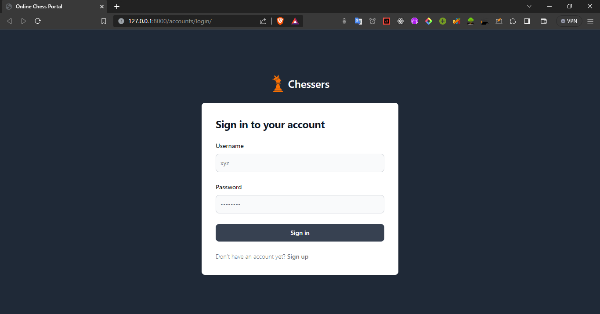
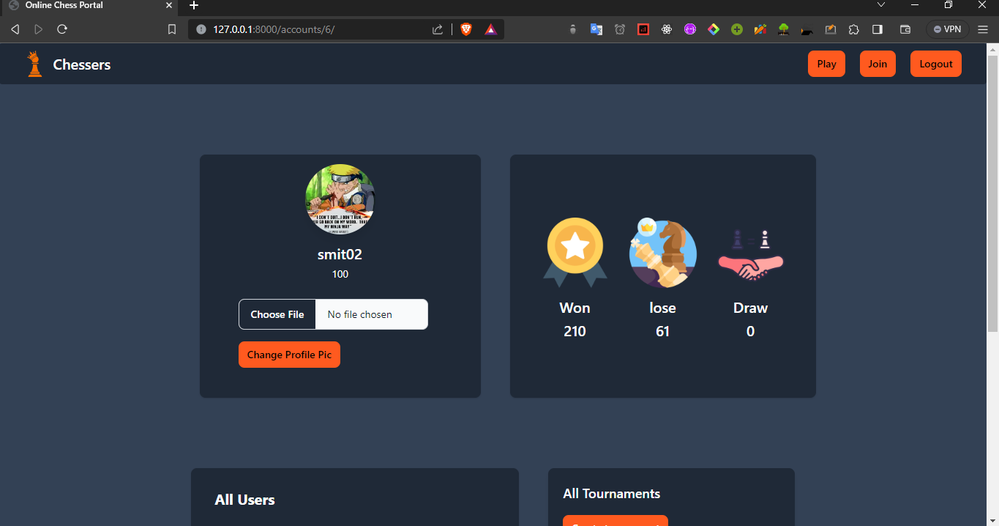
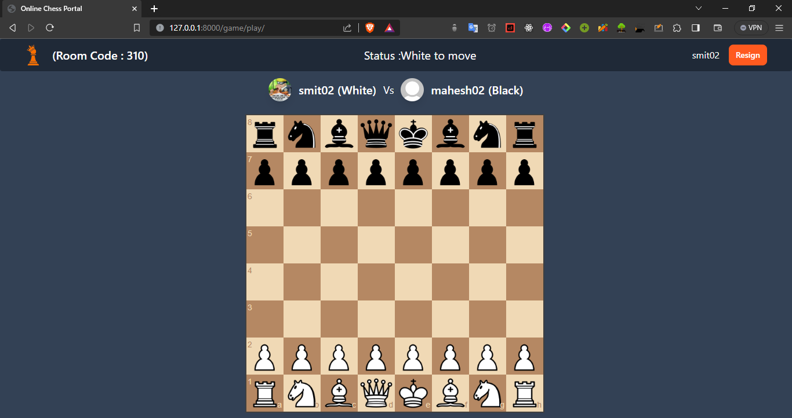
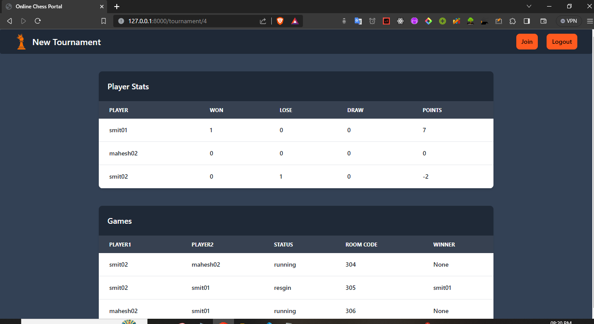

# Online Chess Portal

A portal for chess players to play with other users in realtime

## Table of Contents

- [About](#about)
- [Features](#features)
- [Installation](#installation)
- [Screenshots](#Screenshots)
- [Technologies Used](#technologies-used)

## About

It is platform made with django where user can creat there profile and play with other users in realtime

## Features

Features:

- Play with specific user in realtime
- Change Profile photo
- Create Tournaments and stats of tournament
- Email verification during signup

## Installation and Usage

Installation Steps and Usage:

1. Clone the repository
2. Navigate to the project directory: `cd OnlineChessPortal`
3. Create a virtual environment: `python -m venv venv`
4. Activate the virtual environment:
   - On Windows: `venv\Scripts\activate`
   - On macOS and Linux: `source venv/bin/activate`
5. Run migrations: `python manage.py migrate`
6. Start the development server: `python manage.py runserver`

## Screenshots

## Technologies Used

List the technologies, frameworks, and tools used in the project. For example:

- Python
- Django
- HTML/CSS
- JavaScript
- TalwindCSS + Flowbite
- Chess.js
- Chessboard.js

## Contributing

Explain how others can contribute to the project. You can include guidelines for reporting issues, submitting pull requests, and any other contribution-related information.

## License

Specify the project's license. For example:

This project is licensed under the [MIT License](link-to-license).
